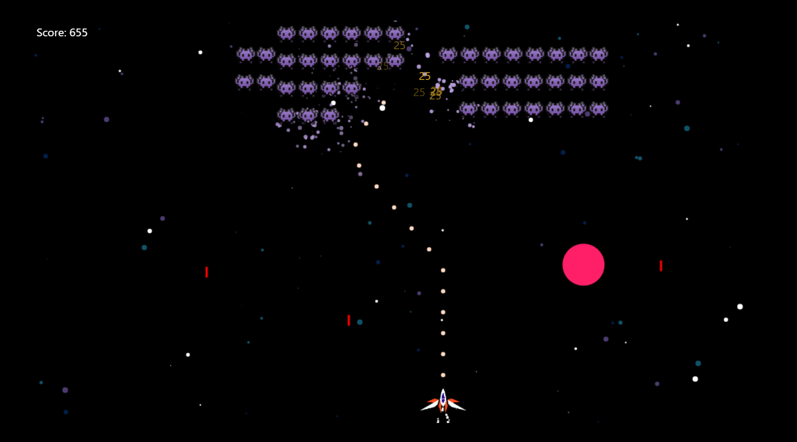

# Space-adventure

Deploy: https://easy-peasy-game.netlify.app

##Description

This is simple game shows the basics principles of creating a game using such technology as a Canvas, JS, React.

##### Moving: 'A', 'D'
##### Shooting: Space
##### Machinegun mode: Catch yellow Star and hold left click

#### `npm run instal`
#### `npm start`

Open [http://localhost:3000](http://localhost:3000) to view it in the browser.

The page will reload if you make edits.

